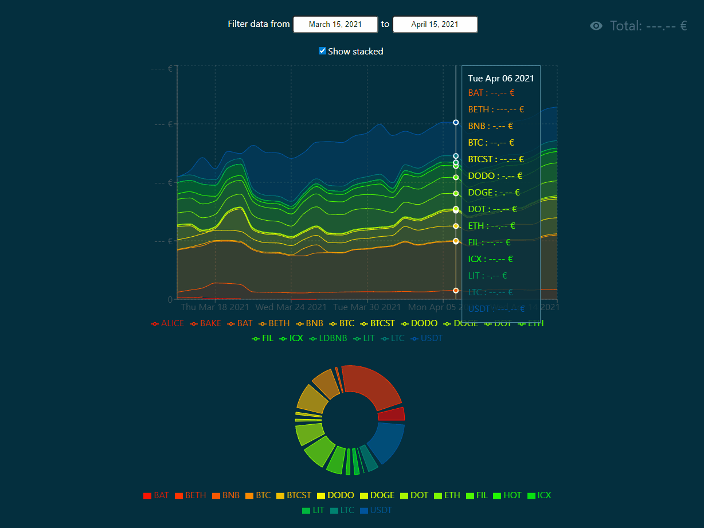

# Crypto Balance

A web application made with Rust and React.

You can see an area chart with all your cryptocurrencies in the same chart. And a **full pie chart** whereas the one Binance offers groups every little amount of crypto in a single "Others" section...



## Usage

You can use this web application with docker-compose.

Edit the `.env` file at the root of the project with your personal API keys.

Once done, simply do the following:

```bash
docker-compose build
docker-compose up -d
```

This will start `mongo` (the database), `mongo-express` (a web interface to manage the database) and `crypto-balance`.

You can access:

- The web app via http://127.0.0.1/
- The MongoDB web interface via http://127.0.0.1:8081/
- The database via the port 27017

## Back-end

The back-end (in Rust) gets daily snapshots of your wallets and the price history for each cryptocurrency you have in your wallets.

Used APIs:

- Binance API for the wallets snapshots (with the [Daily Account Snapshot](https://binance-docs.github.io/apidocs/spot/en/#daily-account-snapshot-user_data) endpoint)
- Nomics API for the price history (with the [Currencies Sparkline](https://nomics.com/docs/#operation/getCurrenciesSparkline) endpoint)

The Binance API **does not give the fiat amount** corresponding to each cryptocurrency you have, hence the need of the Nomics API to get the price history.

A MongoDB database is used to store this data as NoSQL. So when we ask for data in a time range, only the missing data is requested to APIs. The database contains **daily** data points and it is normalized to be at midnight (00:00) for each day.

- Binance API saves snapshots each day at 23:59 (stored in MongoDB as +1 minute, which is the next day)
- Nomics API gives a price history with data points at 00:00 (stored in MongoDB as is)

### Why Binance?

Because that's what I use personally! 😅

Maximum time range for one request: 30 days.

Go [here](https://binance.zendesk.com/hc/en-us/articles/360002502072-How-to-create-API) to know how to create a Binance API key.

### Why Nomics?

It's the only API I found which can give an history anywhere in time **for free**. And the free plan accepts 1 request per second, which is reasonable.

Maximum time range for one request: 45 days.

Go [here](https://p.nomics.com/cryptocurrency-bitcoin-api) to know how to create a Nomics API key.

### How it works?

- Receives an API request from the front-end
- Gets data stored in the MongoDB database
- Computes the time range of this data
- Computes the needed timespans to fill in the blanks (returns vector of timespans)
- If the vector is empty
  - It's up to date
  - Aggregates data (wallet snapshots with price history) and returns as JSON
- If the vector contains 1 (before or after) or 2 (before and after) timespans
  - Split the timespans in multiple timespans of N days maximum (because of API's time range limit)
  - Do as many API requests as timespans
  - Upload the results to the database (the time is a primary key)
  - Aggregates data (wallet snapshots with price history) and returns as JSON

## Front-end

- Built with React
- Charts are made with [Recharts](https://recharts.org/en-US/)
- Built with [esbuild](https://esbuild.github.io/)

## TODO

See the [TODO list](TODO.md).
